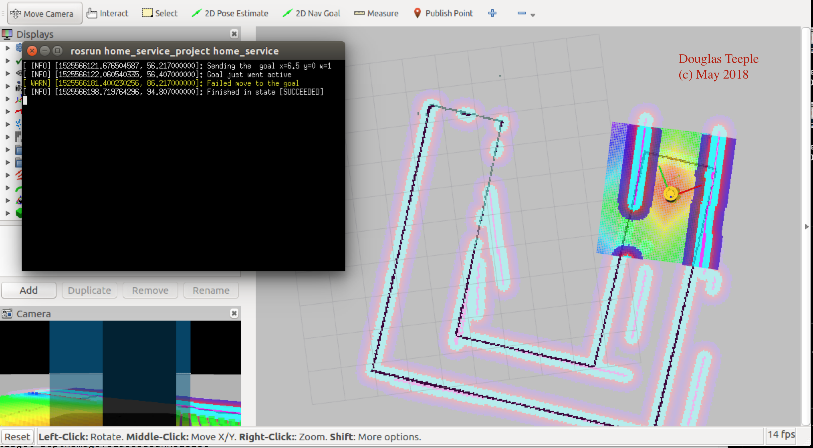
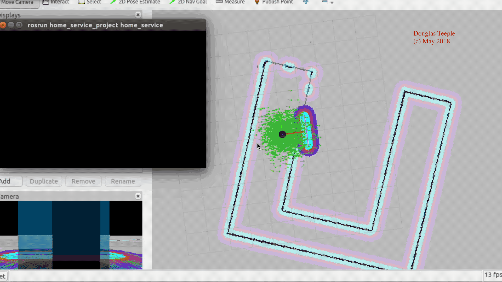

# HomeServiceRobot

The Home Service Robot project develops an environment and a mobile robot which is programmed to pick up an object at one location and deliver it to another location. The project encompasses creating a world in gazebo, mapping it, path planning, localization and using markers to simulate picking up and moving the object.

## Summary of Tasks

The tasks required to complete the project are:

* Design a simple environment using the Building Editor in Gazebo.
* Teleoperate the robot and manually test SLAM.
* Create a wall_follower node that autonomously drives the robot to map the environment.
* Use the 2D Nav Goal arrow in rviz to move to two different desired positions and orientations.
* Write a pick_objects node in C++ that commands the robot to move to the desired pickup and drop off zones.
* Write an add_markers node that subscribes to robot odometry keeping track of the robot pose, and publishes markers to rviz.

## Home Service in Action

