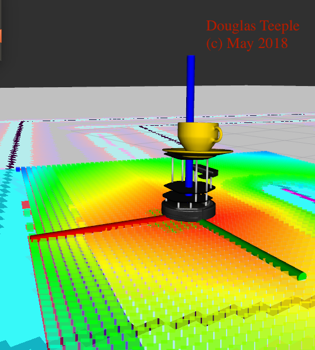
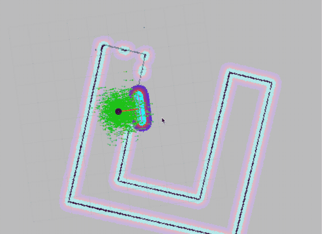

# Home Service Robot Project

The Home Service Robot project develops an environment and a mobile robot which is programmed to pick up an object at one location and deliver it to another location. The project encompasses creating a world in gazebo, mapping it using a wall following node, moving the mobile to goal locations via a path, localization and using markers to simulate picking up and moving the object.

## Summary of Tasks

The tasks required to complete the project are:

* Design a simple environment using the Building Editor in Gazebo.
* Teleoperate the robot and manually test SLAM.
* Create a wall_follower node that autonomously drives the robot to map the environment.
* Use the 2D Nav Goal arrow in rviz to move to two different desired positions and orientations.
* Write a pick_objects node in C++ that commands the robot to move to the desired pickup and drop off zones.
* Write an add_markers node that subscribes to robot odometry keeping track of the robot pose, and publishes markers to rviz.
* Combine all of the forgoing to simulate a robot moving to a pick up point, and carrying a virtual object to a dropoff point.

## The Payload - A Coffee Cup

## Discussion

The project successfully met the course requirements of creating a ROS package that is able to launch the robot and have it map the surrounding area with the models. A custom Gazebo world was created and a map for that environment was created as well. 

I modified one aspect of the project to improve the final "robot carrying virtual object" step. I found when I used the method of subscribing to the robot odometer to implement movement of the virtual marker, that the odom callback was not called often enough as the wait for the robot to reach the goal took most of the available cpu time. I tried various methods of deferring the wait so that the odom callback was smooth, but the results were still unsatisfactory. So instead of attaching the virtual marker frame to the map, I attached it to the base of the robot. So, as the robot moved, the coffee cup virtual marker automatically followed. The results were very smooth and this method was adopted.

I also found it very difficult to get a map that was clean enough for the robot to successfully navigate the world. I ended up running the wall_follower overnight to get the level of detail necessary.

I had trouble with AMCL local mapping being out of sync with the global map. As result the local map would close off corners and prevent path planning from finding a route to the goal. I found that only after creating a very high quality map could the robot complete the path plan.

## Conclusion / Future work

The Jetson TX2 is an excellent platform to implement this project. It has enough computing power to smoothly implement the robot motions. Using this platform I was able to successfully complete all aspects of the project. In the future it would be interesting to put the Jetson board on an actual *roomba* or *turlebot* robot and have it move through a real environment.

## Home Service in Action (Be patient, it takes a moment to get started...)

